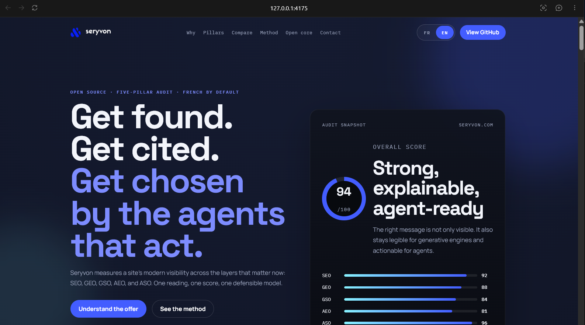
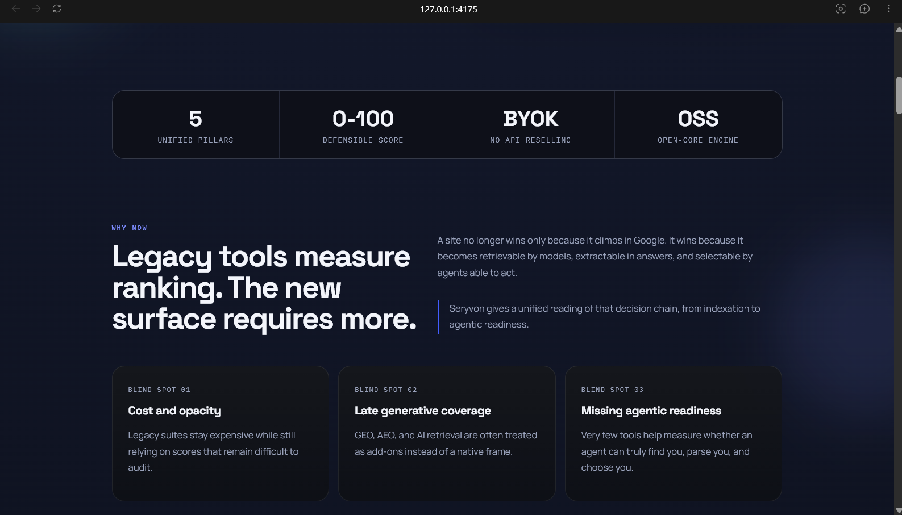
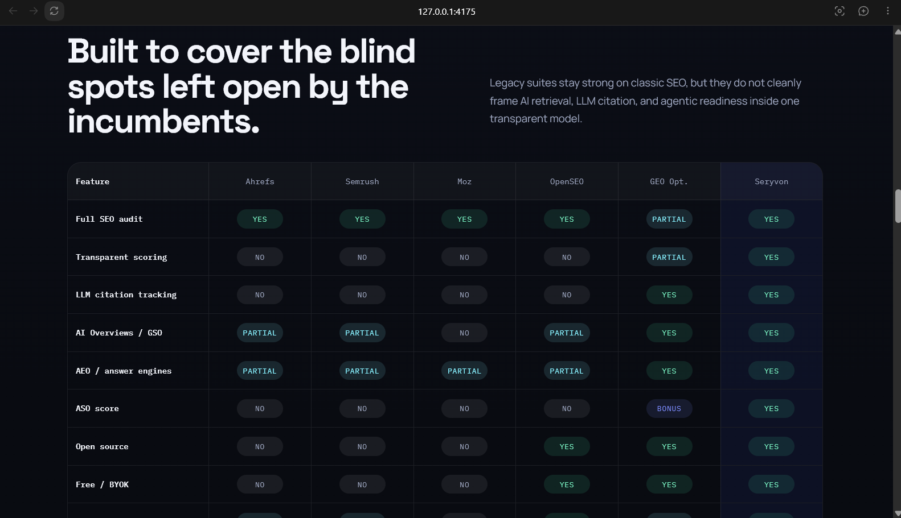
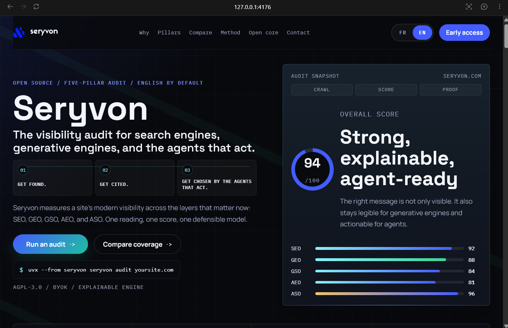
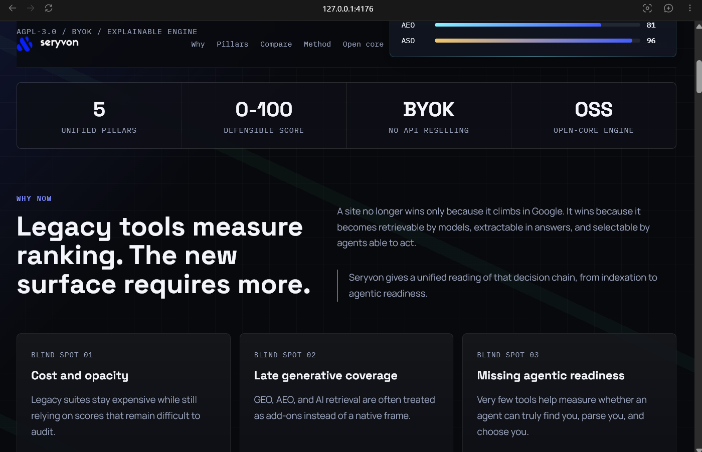
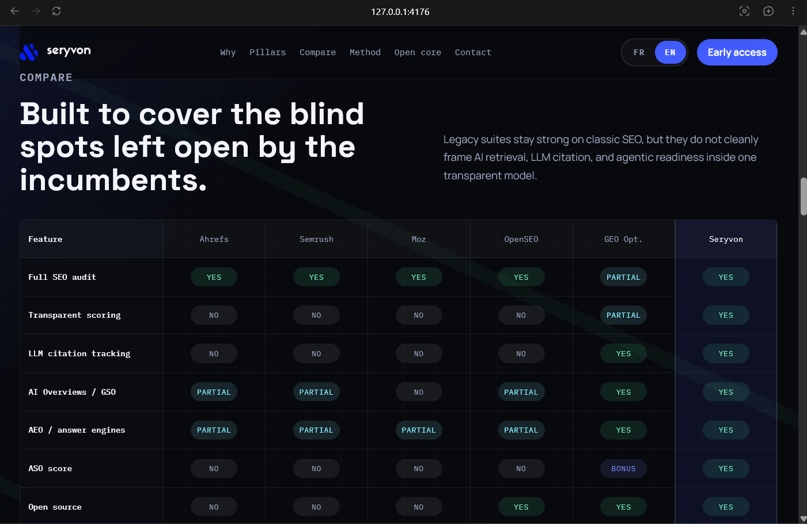
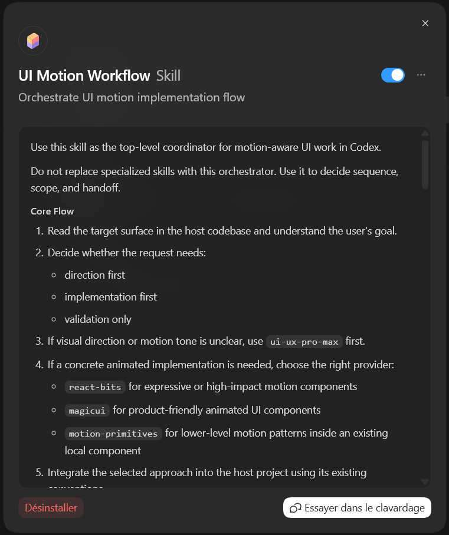

# ui-motion-workflow

Open-source UI orchestration workflow for motion-aware frontend work, browser validation, and agent-guided implementation.

`ui-motion-workflow` helps an AI coding agent move from visual direction to component choice to real browser-validated output.

It is designed for teams working on:

- landing pages
- product marketing surfaces
- polished dashboards
- UI motion systems
- frontend implementation workflows that need more than isolated code edits

## About

`ui-motion-workflow` is an orchestration layer for frontend design execution.

It does not try to replace design systems, animation libraries, or browser tooling. Instead, it coordinates them into a repeatable workflow that an AI coding agent can actually follow.

In practical terms, this repository helps an agent:

1. understand the visual direction of a UI surface
2. decide how much motion is appropriate
3. choose the right implementation path
4. integrate the selected solution into the host codebase
5. validate the result in a real browser

This makes it useful for modern frontend work where the quality bar depends on more than just source code correctness.

## Why This Repo Exists

A lot of AI-assisted frontend work still breaks down in the same place:

- direction is vague
- animation choices are too random
- component selection is driven by novelty instead of fit
- browser validation happens too late or not at all

`ui-motion-workflow` exists to make that sequence more reliable.

It turns polished UI work into a guided chain:

- direction
- provider choice
- implementation
- browser validation
- iteration

## SEO, GEO, GSO, AEO, ASO Context

This repository is about UI orchestration, but its examples and positioning are intentionally useful for teams building discoverable product surfaces in the AI era.

That includes surfaces shaped by:

- `SEO` for classic search discoverability
- `GEO` for generative engine optimization and LLM retrievability
- `GSO` for Google AI Overviews style extractability
- `AEO` for answer engine clarity and citation readiness
- `ASO` for agent search optimization and action-oriented machine readability

In other words, this project is relevant when frontend presentation, content hierarchy, motion, and proof structure all influence whether a product page is found, understood, cited, and chosen.

## Core Idea

The project does not try to replace:

- design intelligence systems
- component libraries
- browser automation or validation tools

Instead, it coordinates them.

Example orchestration flow:

1. establish the visual direction and motion intensity
2. choose a concrete implementation strategy
3. integrate the selected motion component into the host codebase
4. validate the result in a real browser
5. iterate until the motion feels intentional and coherent

## Reference Workflow

Current reference stack:

- `ui-ux-pro-max` for visual direction and motion tone
- `react-bits` for expressive animated React components and showcase effects
- `magicui` for production-friendly UI components with polished motion
- `motion-primitives` for lower-level motion patterns and composable animation building blocks
- browser validation for real output checks on localhost

This stack is a reference implementation, not a hard requirement.

## Provider Roles

Use providers by role, not just by popularity.

- `react-bits`
  Best for bold motion, ambient backgrounds, animated hero treatments, and visually expressive showcase pieces.
- `magicui`
  Best for polished UI components that feel closer to design-system-ready product surfaces.
- `motion-primitives`
  Best when the right answer is not a prebuilt block, but a clean motion pattern embedded into an existing local component.

In other words:

- `react-bits` = wow components
- `magicui` = product-friendly animated UI blocks
- `motion-primitives` = composable micro-motion patterns

## Principles

- Keep the core workflow generic and reusable
- Treat integrations as adapters, not as the product itself
- Prefer intentional motion over decorative noise
- Preserve host codebase conventions during integration
- Validate in the browser, not only in source

## Repository Structure

```text
ui-motion-workflow/
|-- docs/
|   |-- acknowledgements.md
|   |-- architecture.md
|   |-- codex-usage.md
|   |-- providers.md
|   |-- release-checklist.md
|   |-- releases/
|   `-- roadmap.md
|-- providers/
|   |-- README.md
|   |-- magicui.md
|   |-- motion-primitives.md
|   `-- react-bits.md
|-- plugins/
|   `-- ui-motion-workflow/
|       `-- .codex-plugin/plugin.json
|-- implementations/
|   |-- claude-code/
|   |   |-- CLAUDE.md
|   |   `-- README.md
|   |-- codex/
|   |   `-- README.md
|   |-- cursor/
|   |   |-- README.md
|   |   `-- ui-motion-workflow.mdc
|   `-- vscode/
|       |-- README.md
|       `-- copilot-instructions.md
|-- examples/
|   |-- existing-component-enhancement.md
|   |-- README.md
|   |-- dashboard-motion-polish.md
|   `-- marketing-hero-provider-selection.md
`-- LICENSE
```

## Implementation Adapters

Current adapter pack:

- `implementations/codex`
  Reference skill-first implementation for Codex, with an optional repo-scoped plugin artifact.
- `implementations/claude-code`
  Instruction pack for a `CLAUDE.md`-style orchestration workflow.
- `implementations/cursor`
  Cursor-oriented rule file and usage notes for chaining direction, provider choice, and validation.
- `implementations/vscode`
  VS Code-oriented workspace instructions for agent or chat-driven UI motion work.

The non-Codex adapters are intentionally lightweight and text-first. They preserve the workflow contract without pretending that every environment exposes the same plugin model.

## Where To Start

If you are exploring the repository for the first time:

- read [docs/architecture.md](docs/architecture.md) for the workflow model
- read [docs/multi-agent-usage.md](docs/multi-agent-usage.md) for portability rules
- read [docs/providers.md](docs/providers.md) for provider positioning
- open [`implementations/`](implementations/) for environment-specific adapters

If you want the Codex-first setup, start with:

- [docs/codex-usage.md](docs/codex-usage.md)

## Related Repositories And Organization Links

This repository also benefits from being understood in the context of the broader examples and product thinking around [`seryvon-com`](https://github.com/seryvon-com).

Useful navigation points:

- [`seryvon-com`](https://github.com/seryvon-com)
  GitHub organization for the Seryvon product ecosystem and related examples.
- [`seryvon-com/seryvon`](https://github.com/seryvon-com/seryvon)
  Product repository for Seryvon itself, useful when you want to see how a visibility-oriented product can be presented and evolved.

The Seryvon examples used in this README are product-facing Powehi examples published in the broader seryvon-com ecosystem.

## Before And After Example

Using `seryvon-website` as a concrete test bed, we can show the difference between:

- `before orchestrator`
  A version shaped mainly through UI direction alone.
- `after orchestrator`
  A version improved through the full workflow: direction review, provider choice, implementation, and browser validation.

Before:







After:







The result feels more orchestrated because the page now has a clearer narrative sequence instead of a set of polished but mostly parallel sections.

The hero now explicitly frames the product journey as Get found, Get cited, and Get chosen, which makes the five-pillar story easier to understand immediately. The audit panel also has clearer product signals with Crawl, Score, and Proof, so the visual proof feels connected to the product workflow rather than decorative.

Motion is more intentional: section reveals are staggered, bar fills progress in sequence, and hover states are restrained. The animation supports reading order instead of competing with the content.

The page rhythm is tighter too. The first viewport now hints at the proof metrics on desktop and mobile, CTAs are more legible, and the Pro / Team offer is visually prioritized without making the pricing section feel noisy. Overall, the page reads less like individual nice sections and more like one guided product argument.

## Public Roadmap

Short version:

- improve install guidance per environment
- add stronger real-world examples and screenshots
- refine browser-validation workflows
- keep the core orchestration portable while expanding adapters

See [docs/roadmap.md](docs/roadmap.md) for the fuller roadmap.

## Acknowledgements

`ui-motion-workflow` builds on an open-source ecosystem rather than replacing it.

Special thanks to the maintainers and contributors behind projects in the reference stack and surrounding workflow, including `ui-ux-pro-max`, `react-bits`, `magicui`, and `motion-primitives`.

For explicit attribution and reuse notes, see [docs/acknowledgements.md](docs/acknowledgements.md).

## Installed In Codex

After installation, the skill appears directly inside Codex and can be toggled and inspected like other installed skills:


## License

MIT

## Codex Installation

This repository includes a repo-scoped Codex plugin artifact:

```text
plugins/ui-motion-workflow/
```

and a repo-scoped marketplace file:

```text
.agents/plugins/marketplace.json
```

For a local checkout, the usual flow is:

1. add the repo marketplace root to Codex
2. install `ui-motion-workflow` from that marketplace

See [docs/codex-usage.md](docs/codex-usage.md) for the Codex-oriented workflow details.


